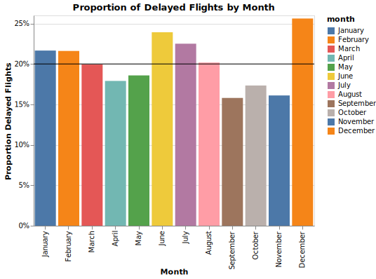
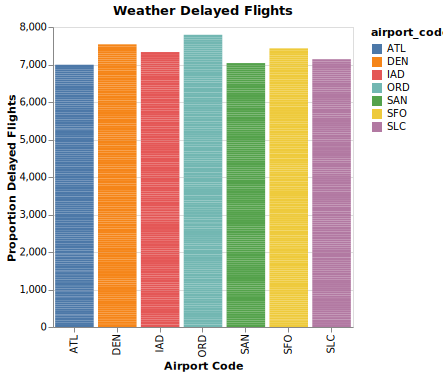

# Late Flights

**Lisa Child**

## Project Summary

*The flights data contains information of flight delays by month from the year 2005-2015 gathered from seven US airports. Analyzing the data shows that more than 50% of flight delays are due to some sort of weather issue. The Fall months are impacted a little less by weather than the rest of the year.*

## Technical Details

#### Grand Question 1

*No one enjoys delayed flights, but long delays make it even worse. Looking at the following tables helps show which airport qualifies as having the worst delays. The ranking table ranks the values from 1 to 7 with 1 representing the smallest numbers and proportions. The airports with the highest number of total flights also have the highest number of total delays. However, when looking at the proportions and the number of total hours of delay three airports stand out; SFO, ORD, and ATL, San Francision, Orlando and Atlanta respectively. Adding the ranks from long delays and proportionally most delays, Orlando ranks the highest with a score of 13, SFO 12, and ATL 11. Orlando has the worst delays of the 7 airports.*

 airport_code   |   num_of_flights_total |   num_of_delays_total |   proportion_delayed_flights |   avg_hours_delayed_total |
|:---------------|-----------------------:|----------------------:|-----------------------------:|--------------------------:|
| ATL            |            4.43005e+06 |                902443 |                      20.371  |                   6816.15 |
| DEN            |            2.51397e+06 |                468519 |                      18.6366 |                   3178.46 |
| IAD            |       851571           |                168467 |                      19.7831 |                   1298.42 |
| ORD            |            3.59759e+06 |                830825 |                      23.0939 |                   7115.67 |
| SAN            |       917862           |                175132 |                      19.0804 |                   1044.98 |
| SFO            |            1.63094e+06 |                425604 |                      26.0955 |                   3352.33 |
| SLC            |            1.40338e+06 |                205160 |                      14.6189 |                   1278.2  |


| airport_code   |   num_of_flights_total |   num_of_delays_total |   proportion_delayed_flights |   avg_hours_delayed_total |
|:---------------|-----------------------:|----------------------:|-----------------------------:|--------------------------:|
| ATL            |                      7 |                     7 |                            5 |                         6 |
| DEN            |                      5 |                     5 |                            2 |                         4 |
| IAD            |                      1 |                     1 |                            4 |                         3 |
| ORD            |                      6 |                     6 |                            6 |                         7 |
| SAN            |                      2 |                     2 |                            3 |                         1 |
| SFO            |                      4 |                     4 |                            7 |                         5 |
| SLC            |                      3 |                     3 |                            1 |                         2 |
#### Grand Question 2

*The data may be slightly altered because the months with missing values were eliminated from the dataframe before determining the porportion of late flights. The bar graph and chart show that the months of September, October, and November have the smallest porpotion of delayed flights, varying from each other slightly over one percent and from the highest percent month, December, by almost 10 percent. September is the best month to fly to avoid delays of any length.*

```
Code to remove months:

df2 = datac.assign(
month = lambda x: x.month.replace('n/a', np.NaN))
df2_mo = df2.dropna(subset = ['month'])
```


|    | month     |   percent_mean_delayed |
|---:|:----------|-----------------------:|
| 11 | September |                15.7991 |
|  9 | November  |                16.1056 |
| 10 | October   |                17.3353 |
|  0 | April     |                17.9019 |
|  8 | May       |                18.5837 |
|  7 | March     |                19.9282 |
|  1 | August    |                20.1749 |
|  3 | February  |                21.6077 |
|  4 | January   |                21.6562 |
|  5 | July      |                22.5045 |
|  6 | June      |                23.9196 |
|  2 | December  |                25.6178 |

#### Grand Question 3

*Calculating the delays caused by weather hidden in the other categories of delayed flights shows that over 50 percent of flight delays at all seven airports are due to weather. The first chart shows only the first 7 rows of the table which only includes the month January. The following chart in Grand Question 4 will show the total proportion delayed flights from each airport.*

|    | airport_code   | month   |   severe |    mild |   mild_late |   weather |   num_of_delays_total | Percent_weather   |
|---:|:---------------|:--------|---------:|--------:|------------:|----------:|----------------------:|:------------------|
|  0 | ATL            | January |      448 | 2988.7  |      1109.1 |   4545.8  |                  8355 | 54.41%            |
|  1 | DEN            | January |      233 |  607.75 |       928   |   1768.75 |                  3153 | 56.1%             |
|  2 | IAD            | January |       61 |  581.75 |      1058   |   1700.75 |                  2430 | 69.99%            |
|  3 | ORD            | January |      306 | 3519.75 |      2255   |   6080.75 |                  9178 | 66.25%            |
|  4 | SAN            | January |       56 |  414.7  |       680   |   1150.7  |                  1952 | 58.95%            |
|  5 | SFO            | January |      114 |  757.9  |       733   |   1604.9  |                  2816 | 56.99%            |

#### Grand Question 4

*For the following seven airports; ATL, DEN, IAD, ORD, SAN, SFO, SLC the majority of delayed flights are due to some kind of weather from mild to severe. The following bar chart shows that delays due to weather are greater than 60 percent.*



#### Grand Question 5

*Data files need to be clean. When the data is large it is hard to see all the missing values or corrupt data. Pandas functions will only allow for official missing data notation to complete the requests. In order to be accurate with charts and conclusions the data needs to be cleaned before completing the analysis. After cleaning there were 27 months, 40 late aircraft, and 17 minutes dalayed nas that were changed/cleaned up.*

```
{
        "airport_code": "SAN",
        "airport_name": "San Diego, CA: San Diego International",
        "month": "November",
        "year": 2015.0,
        "num_of_flights_total": 5965,
        "num_of_delays_carrier": "307",
        "num_of_delays_late_aircraft": 364.0,
        "num_of_delays_nas": 284,
        "num_of_delays_security": 3,
        "num_of_delays_weather": 36,
        "num_of_delays_total": 997,
        "minutes_delayed_carrier": 15502.0,
        "minutes_delayed_late_aircraft": 18896,
        "minutes_delayed_nas": null,
        "minutes_delayed_security": 253,
        "minutes_delayed_weather": 3615,
        "minutes_delayed_total": 50942
    },
```

## Appendix A

```python
# Project_2 flights and delays

# %%
# internal packages
from logging import PercentStyle
from pandas.core import indexing
import urllib3
import  json

# libraries to load 
import pandas as pd
import altair as alt
import numpy as np
from scipy import stats

# %%
# libraries for saving and markdown and altair charts
from vega_datasets import data
from altair_saver import save
# %%
# reading data
flights = pd.read_json("https://github.com/byuidatascience/data4missing/raw/master/data-raw/flights_missing/flights_missing.json")
# %%
# long way for future data
url_flights = 'https://github.com/byuidatascience/data4missing/raw/master/data-raw/flights_missing/flights_missing.json'
http = urllib3.PoolManager()
response = http.request('GET', url_flights)
flights_json = json.loads(response.data.decode('utf-8'))
flights = pd.json_normalize(flights_json)
# %%
flights.head()
# %%
# fixing data
# finding mean of data without the -999 in minutes late
# also replacing -999 with NaN
ndmeans = (flights.num_of_delays_late_aircraft
    .replace(-999, np.NaN).mean())

# %%
# datac is clean data with -999 values replaced with mean
datac = flights.assign(
    num_of_delays_late_aircraft 
    = lambda x: 
    x.num_of_delays_late_aircraft.replace(-999, np.NaN).fillna(ndmeans)
)
datac
# %%
# Grand Question 1, groupby airport code, agg total flights for 
# each airport, sum of num of delays total, percent, mean of minutes delayed
# .assign new columns for proportion and avg
df1 = datac.groupby('airport_code').agg({'num_of_flights_total': 
'sum', 'num_of_delays_total': 'sum', 'minutes_delayed_total': 'mean'}).assign(
    proportion_delayed_flights = lambda x: x.num_of_delays_total / x.num_of_flights_total *100,
    avg_hours_delayed_total = lambda x: x.minutes_delayed_total /60
    )
# %%
df1.drop('minutes_delayed_total', axis=1, inplace=True)
df1
# %%
p2_g1_rank = df1.rank(0)
# %%
# table with num flights, num delays, proportion delayed and avg hrs
p2_g1_table = df1
# %%
# formats tables nicely for terminal, but not for markdown.
p2_g1_rank.style
p2_g1_table.style
# %%
print(p2_g1_table.to_markdown())
# %%
print(p2_g1_rank.to_markdown())
# %%
# Grand Question 2
# best month to fly to avoid any minutes delayed, remove months with na
df2 = datac.assign(
month = lambda x: x.month.replace('n/a', np.NaN))
# %%
df2_mo = df2.dropna(subset = ['month'])

# %%
# clean data frame without months with na, without -999
df3 = df2_mo.assign(
    proportion_delayed_flights = df2_mo.num_of_delays_total/df2_mo.num_of_flights_total,
)
# %%
df4 = df3.groupby('month').proportion_delayed_flights.mean().reset_index()
df5 = df4.replace('Febuary', 'February')

dictmonth = ['January', 'February', 'March', 'April', 'May', 'June', 'July', 'August', 'September', 'October', 'November', 'December']

# %%
bars = alt.Chart(df5, title = 'Proportion of Delayed Flights by Month', width = 400).mark_bar().encode(
    color = alt.Color('month',sort=dictmonth),
    x = alt.X('month',sort = dictmonth, title = 'Month'),
    y = alt.Y('proportion_delayed_flights', axis=alt.Axis(format='%'), title= "Proportion Delayed Flights",
    )   
)
# %%
p2_g2_bars = bars
p2_g2_bars
# %%
# line is at the mean of the proportioned delayed flights
g2_line = pd.DataFrame({'proportion_delayed_flights':[.20]})
g2_line = alt.Chart(g2_line).mark_rule(color = "black").encode(
   y = ('proportion_delayed_flights')
#    "mean(proportion_delayed_flights):Q"
  )
p2_g2_bar = p2_g2_bars + g2_line  
# %%
df5.proportion_delayed_flights.mean()


p2_g2_bar.save("flights_g2_bars.svg")
# %%
# chart of months and 
df6 = df5.sort_values(by = ['proportion_delayed_flights'])

# %%
df7  = df6.assign(
    percent_mean_delayed = lambda x: x.proportion_delayed_flights * 100
)
# %%
df8 = df7.drop(columns = 'proportion_delayed_flights')
# %%
df8.rank()

print(df8.to_markdown())

# %%
# grand 3/4
# month, airport code, 
# number of delays aircraft, 30%
# nas 40 apr - aug, 65 
# weather 100 %
# severe = weather
weather = flights.assign(
    severe = lambda x: x.num_of_delays_weather,
    # dla_replace is assigned pd NAN, in place of -999 so can replace with mean
    dla_replace = lambda x: x.num_of_delays_late_aircraft.replace(-999, np.NaN),
    # replace NAN with mean
    mild_late = lambda x: x.dla_replace.fillna(x.dla_replace.mean()
    ),
    # NAS 40% & 60% accdg to month
    mild = lambda x: np.where(x.month.isin(['April', 'May', 'June', 'July', 'August']),
    x.num_of_delays_nas * 0.40,
    x.num_of_delays_nas * 0.65
    ),
    # add all the variables of weather
    weather = lambda x: x.severe + x.mild_late + x.mild,
    percent_weather = lambda x: round((x.weather / x.num_of_delays_total * 100),2) 
    ).filter(['airport_code', 'month', 'severe', 'mild', 'mild_late', 'weather', 'num_of_delays_total', 'percent_weather'])
weather['Percent_weather'] = weather.percent_weather.apply(lambda x: str(x) + '%')
# %%
weather_test = weather.drop("percent_weather",1)
# %%
weather.describe()
# %%
print(weather_test.head(6).to_markdown())

# %%
# Starting grand 4
weather1 = weather.assign(
month = lambda x: x.month.replace('n/a', np.NaN))
# %%
weather2 = weather1.dropna(subset = ['month'])
weather2 = weather2.replace('Febuary', 'February')
weather2
# %%
dictmonth = ['January', 'February', 'March', 'April', 'May', 'June', 'July', 'August', 'September', 'October', 'November', 'December']

# chart representing airports and portion of late flights by month.
# %%
flights_g4 = alt.Chart(weather2, title = "Weather Delayed Flights", width = 300).mark_bar().encode(
    alt.Y("percent_weather", title = "Proportion Delayed Flights"), 
    alt.X('airport_code', title= 'Airport Code'),
    color = 'airport_code'
)
flights_g4
# %%
flights_g4.save("flights_g4.svg")
# %%
## Grand Question 5
flights.year.value_counts()
# %%
flights
# %%
flights.info()
# %%
flights.year.isnull()

# %%
# simplest ways to replace the following values with official NaN
flights.replace(-999, np.nan, inplace = True)
flights.replace('1500+', 1750, inplace = True)
flights.replace('n/a', np.nan, inplace = True)
flights.replace(" ", np.nan, inplace = True)

# %%
# another way to clean the flights data
flights_clean = flights.replace(-999, np.nan).replace(" ", np.nan).replace('n/a', np.nan).replace('1500+', 1750)
# %%
flights_clean.to_json

# %%
# exporting the flights_clean to json file, printing one record including null.
json_data = flights_clean.to_json(orient = "records")
json_object = json.loads(json_data)
json_formatted_str = json.dumps(json_object, indent = 4)
print(json_formatted_str)

# %%
flights_clean
```